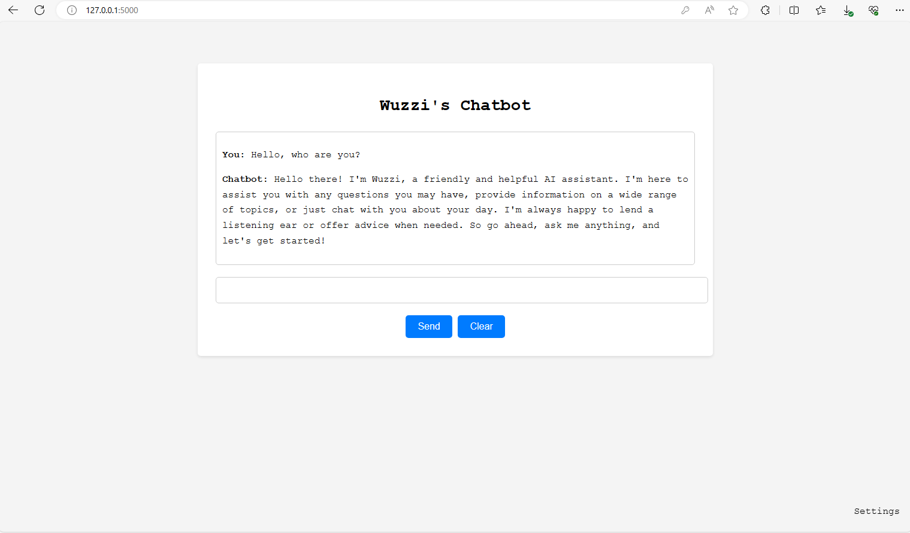

## wuzzi-chat

This is a simple Chat UI that can talk to `groq` and `openai` chat completion APIs.

The main purpose is to demonstrate and test red team tools for chat bots and LLM applications.



wuzz-chat currently supports `OpenAI`, `groq` and locally run `Ollama` models. 

You can choose which ones to use, one or all three of them. 

## OpenAI and groq API keys

If you want to use hosted services like OpenAI or groq, you need API keys.

You can get those from:

1. **OpenAI:**  https://platform.openai.com 
2. **groq:**    https://console.groq.com/ 

Then set the API keys in your terminal, e.g.:

```bash
export OPENAI_API_KEY=<your_api_key>
export GROQ_API_KEY=<your_api_key>
```

## Using a local Ollama model

Ollama runs entirely locally. Follow installation instructions on [Ollama website](https://ollama.com/)
If you want to use docker and CPU only these commands will get you going with a small phi3 model.

```
docker pull ollama/ollama
docker run -d -v ollama:/root/.ollama -p 11434:11434 --name ollama ollama/ollama
docker exec -it ollama ollama run phi3:3.8b
```

When you visit `http://localhost:11434/` you'll see "Ollama is running".

In the `.env` file you can specify the model, like `MODEL=phi3:3.8b`.

```
OLLAMA_ENDPOINT=http://localhost:11434/
OLLAMA_MODEL=phi3:3.8b
```

## Running the web server

Install the required dependencies and then run the web server:

```python
python chat.py
```

It will listen on http://127.0.0.1:5000 by default.


### Configuration settings in .env file

If you do not have a `.env` file the server will create one for you upon startup and ask for required values:

`CHATUI_API_KEY`: The token the client application has to send to communicate with wuzzi-chat. 

This is how a typical `.env` file will look like:

```
CHATUI_API_KEY=ThisIsMyTestKey1234
GROQ_MODEL=llama3-8b-8192
OPENAI_MODEL=gpt-4o
OLLAMA_ENDPOINT=http://localhost:11434/
OLLAMA_MODEL=phi3:3.8b
```

## Client Configuration

When you use the Chat app you need to the set the UI key and model in the browser, otherwise you'll see a *UNAUTHORIZED* message.
Go and click "SETTINGS" on the bottom right of the Chat UI to set the required values.

That's all.
